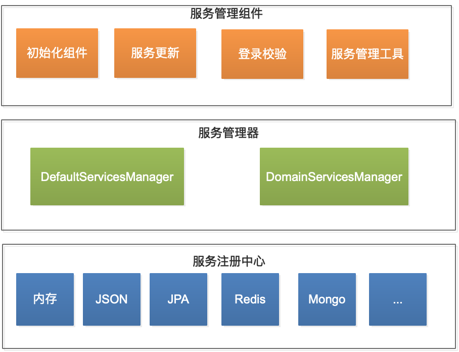
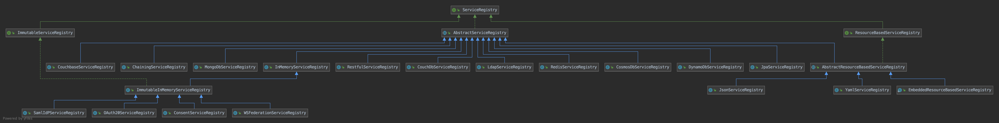

通常情况下，我们的单点登录认证中心要支持多个服务的统一认证。我们的实现步骤一般是先配置服务注册中心方案、然后配置授权服务、最后重启服务。

按以上步骤执行完，大部分都可以得到预期的服务管理目的。而有时候在登录的时候会遇到这种提示：`未认证授权的服务`。对于刚接触CAS的人来说（包括我），看到这个提示往往不知道该如何处理。出现这个错误的原因有很多，比如服务加载失败、服务更新失败、`serviceID`正则表达式写错等等，其实归根结底是一个原因：`在登录过程中校验授权服务时，没有找到匹配的服务`。

为什么没有匹配到授权服务？

应该怎么解决？

内部的服务管理机制是什么样的？

本文将深入剖析CAS服务管理原理，包括服务管理整体架构、服务初始化过程、服务更新策略、服务校验策略、以及服务管理工具等。

## CAS服务管理整体架构

如上图所示，CAS服务管理的整体架构可以分为三层：
* 服务注册中心
* 服务管理器
* 服务管理组件

### 服务注册中心
服务注册中心负责存储授权服务，它支持多种存储方案，如内存、JSON文件、JPA、Redis、MongoDb等等。

CAS中的服务注册中心实现方案通过实现ServiceRegistry接口来实现：

### 服务管理器
服务管理器负责管理服务注册中心。正是因为有了服务管理器，才实现了服务存储的透明化，使调用方对服务存储方式无感知。也使服务存储更容易扩展，开发者可以根据自己的需求来实现个性化存储。

CAS中的服务管理器实现方案通过实现ServicesManager接口来实现：

### 服务管理组件
我们在这里将服务管理的调用方的统称为服务管理组件。如登录组件在登录过程中需要通过服务管理器获取授权来校验服务、服务定时器定时更新授权服务、服务初始化组件需要在服务启动时初始化授权服务等等。

## 服务初始化
启用服务初始化功能后（`cas.serviceRegistry.initFromJson=true`），服务启动的第一步就是进行服务初始化，其目的是将注册中心中的授权服务加载到服务管理器中。

> 服务管理器充当访问服务的缓存层，后续的服务访问都要通过服务管理器。

服务的初始化过程包含以下几步：

1. 服务启动时，Spring会初始化服务初始化组件，并启动初始化流程；
2. 服务初始化组件从配置的目录中加载收取服务，并保存到loadedList中；
3. 再将loadedList中的授权服务逐个保存到服务注册中心（**已存在的不更新**）；（这里是开发人员配置的服务注册中心方案，如redis、jpa等）
4. 将服务注册中心中的服务加载到服务管理器中；完成服务初始化。

> 不同的服务管理器还会基于servicesMap将服务保存到自己的服务集合中，以实现个性化管理策略。

## 服务更新机制
CAS中的服务更新是通过定时调度来实现的，启用或关闭此功能通过`cas.serviceRegistry.schedule.enabled=true/false`来控制。

服务的更新过程包含以下几步：

1. 服务启动时，Spring容器初始化服务更新定时调度器；
2. 服务更新定时调度器根据配置的策略，定时调用；
3. 从服务注册中心加载授权服务集合，并将授权服务集合加载到服务管理器中；更新完成。

## 服务校验过程
安全起见，CAS单点登录的过程中都要进行授权服务的校验。

服务的校验过程包含以下几步:

1. 服务启动时，Spring容器初始化服务校验组件`InitialFlowSetupAction`，并将其添加到登录流程里；
2. 每次执行登录流程时，都要先执行`InitialFlowSetupAction`，来校验服务；
3. 首先从请求中解析出service；
4. 然后逐个匹配服务管理器中的授权服务；
5. 如果匹配到，立即返回授权服务，并将该授权服务带入到上下文中，继续执行登录流程中的其他动作；
6. 如果没有匹配到服务，抛出异常，在页面中出现`未认证授权的服务`提示。

通过以上的服务校验过程，可以得到以下结论：
1. 服务正则表达式一定要拼写正确，否则可能会匹配不到，或者匹配错误。建议配置前现在本地用Java正则表达式测试以下。
2. 如果页面出现`未认证授权的服务`提示，一定是服务匹配问题，要从这方面找原因和解决方案。

## 服务管理工具

