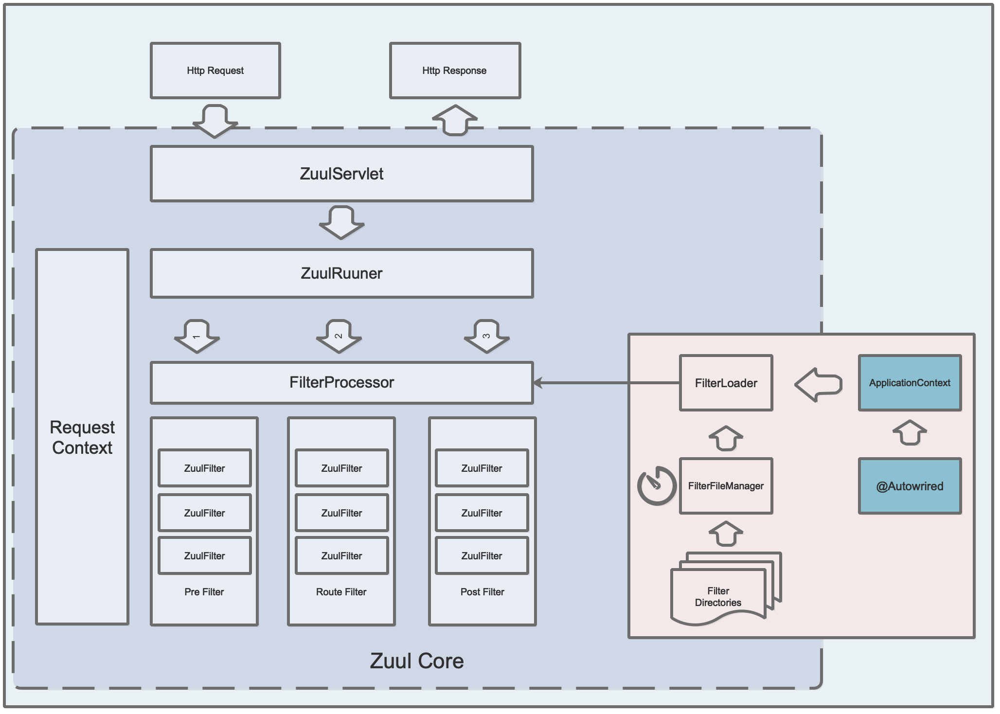

**本文是草稿，还没完成**

在当下流行的微服务架构中，面对多端应用时我们往往会做前后端分离：如前端分成APP端、网页端、小程序端等，使用Vue等流行的前端框架交给前端团队负责实现；后端拆分成若干微服务，分别交给不同的后端团队负责实现。

这样划分后前端怎么和后端接口交互呢？如果是前端页面分别调用各个微服务的接口，显然不太好，因为前端要知道每个微服务的细节，且很可能会导致调用链路混乱。

这个时候就需要有个组件负责前后端之间的交互，在微服务生态体系中我们将该组件称之为**网关**。

网关是Spring Cloud生态体系中的基础组件之一，它的主流实现方案有两个：

1. Spring Cloud Netflix Zuul
2. Spring Cloud Gateway

两者的主要作用都是一样的，都是代理和路由。牵着是基于Netflix Zuul实现的，猴子两者的对比不在本文讨论范围内，本文主要聚焦于Spring Cloud Netflix Zuul。

本文的焦点主要是剖析Zuul内部的实现原理，如网关初始化过程、路由处理流程、过滤器种类及其功能、度量指标、管理端点等。

> Spring Cloud Netflix Zuul的集成方式非常简单，不是本文的重点，有需要的可以参考[这里](https://jbone.cn/translate/spring-cloud-netflix-zuul/)

## Spring Cloud Netflix Zuul架构总览

如上图所示，整体架构上可以分为两个部分，即Zuul Core和Spring Cloud Netflix Zuul。

其中Zuul Core部分即Zuul的核心，负责网关核心流程的实现；

Spring Cloud Netflix Zuul负责包装Zuul Core，其中包括Zuul服务的初始化、过滤器的加载、路由过滤器的实现等。

从上图中我们可以看出Zuul网关的工作流程：

1. 容器启动时，Spring Cloud初始化Zuul核心组件，如ZuulServlet、过滤器等。

2. ZuulServlet处理外部请求：

    1. 初始化RequestContext
    
    2. ZuulRunner发起执行Pre过滤器，并最终通过FilterProcessor执行
    
    3. ZuulRunner发起执行Route过滤器，并最终通过FilterProcessor执行
    
    4. ZuulRunner发起执行Post过滤器，并最终通过FilterProcessor执行
    
    5. 返回Http Response

## 服务初始化过程

Spring Cloud Netflix Zuul中初始化网关服务有两种方式：`@EnableZuulServer`和`@EnableZuulProxy`。

这两种方式都可以启动网关服务，不同的主要地方是：

1. `@EnableZuulProxy`是`@EnableZuulServer`的超集，即使用`@EnableZuulProxy`加载的组件除了包含使用`@EnableZuulServer`加载的组件外，还增加了其他组件和功能；
2. `@EnableZuulServer`是纯净版的网关服务，不具备代理功能，只实现了简单的请求转发、响应等基本功能，需要自行添加需要的组件；
3. `@EnableZuulProxy`在`@EnableZuulServer`的基础上实现了代理功能，并可以通过服务发现来路由服务。

如图所示，`@EnableZuulServer`和`@EnableZuulProxy`的初始化过程一致，最大的区别在于加载的过滤器不同。

其中蓝色是`@EnableZuulServer`加载的过滤器；红色是`@EnableZuulProxy`额外添加的过滤器。

## 路由处理流程

1、路由处理的流程
2、说明过滤器四个核心方法
3、说明包含Pre、Route、Post和Error四种类型过滤器

### Pre Filter
描述Pre类型过滤器的功能

### Route Filter    
描述Route类型过滤器的功能

### Post Filter
描述Post类型过滤器的功能

### Error Filter
描述Error类型过滤器的功能

## Metrixs
Zuul度量指标

## Endpoints
Zuul新增的管理端点

## 关于作者
马军伟，草根码农一枚，jbone项目作者。

关注领域：微服务、高并发编程、单点登录等。

Github：https://github.com/417511458

Gitee: https://gitee.com/majunwei2017

主页：http://jbone.cn

QQ: 417511458

公众号：writebugs

